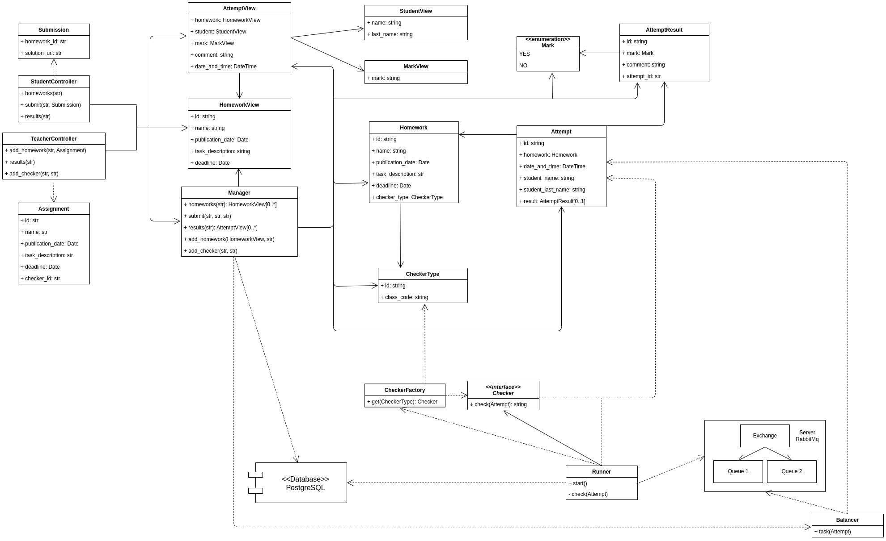

# Design document

## Список разработчиков

- Жемчужина Елизавета
- Кириллова Евгения
- Сунко Елена
- Иценко Екатерина

## Общие сведения о системе

### Назначение

Система представляет из себя веб-сервис для проверки домашних заданий.

### Границы системы

- Наличие веб-интерфейса
- 1 студент, 1 преподаватель, 1 курс
- Нет авторизации
- Нет валидации пользовательского ввода (считаем, что нам, например, не будут засылать вирус)

### Контекст

- Наличие веб-интерфейса
- REST API для доступа к информации, хранимой в системе

## Architectural drivers

### Технические ограничения

Должны быть предусмотрены библиотеки для работы с _RabbitMQ_, _PostgreSQL_ и _HTTP-запросами_.

### Бизнес-ограничения

- Срок разработки ограничен одной неделей
- В силу отсутствия бюджета, используются бесплатные фреймворки и библиотеки

### Качественные характеристики системы

- Система должна быть достаточно гибкой для дальнейшей расширяемости

### Ключевые функциональные требования

- Поскольку один студент может осуществлять несколько посылок, а чекер может работать долго предусмотрена балансировка
  нагрузки

## Architectural views

### Роли и случаи использования

#### Роли

- Студент
- Преподаватель

#### Случаи использования

- Студент может просматривать список домашних работ, отсортированный по близости дедлайна, причём должны показываться
  только работы, дата публикации которых уже наступила
- Студент может сдать решение в виде ссылки на GitHub — для этого ему надо кликнуть на элемент списка домашних работ, в
  результате чего он попадёт на экран с детальной информацией о работе (включая полное условие), полем для ввода ссылки
  на решение и кнопкой «Submit»
- Студент может просмотреть список результатов, отсортированный по дате сдачи
- Студент может просмотреть детальную информацию о попытке по клику на элемент списка результатов, включая текстовый
  вывод программы-проверялки
- Преподаватель может добавить новую домашнюю работу
- Преподаватель может просмотреть список результатов, отсортированный по дате сдачи
- Преподаватель может просмотреть детальную информацию о попытке по клику на элемент списка результатов, включая
  текстовый вывод программы-проверялки
- Преподаватель может добавить свою проверялку

#### Типичный пользователь

Это студентка ПМИ Елизавета Жемчужина. Она утомляется, когда делает домашнее задание, поэтому она хотела бы использовать
эффективную систему автоматической проверки, чтобы после сдачи задания больше о нем не думать. Кроме того, Елизавета
иногда хочет посмотреть на список уже сданных заданий, чтобы понять, какая она молодец.

Это преподаватель ПМИ Илона Маскова. Она очень устает от проверок домашних работ Елизаветы и хочет поменьше смотреть на
ее код. Именно поэтому она хочет пользоваться системой автоматической сдачи работ. Иногда Илона хочет посмотреть, почему
Елизавета сдала задачу всего со 101-ой попытки, поэтому ей нужна информация обо всех попытках сдачи.

P.S. Все совпадения с реальными людьми случайны.

### Композиция

TODO

TODO словесное описание

#### Описания компонент:

TODO

### Логическая структура

**Примечание**: на данном этапе названия и типы условные, уточнения будут внесены на этапе реализации.

#### Controller

Отвечает за обработку входящих запросов.

##### class StudentController

Класс-контроллер, отвечающий за действия (запросы) студента.

**Методы**:

- `homeworks(str)` - получение списка всех домашек в нужном порядке. В качестве аргумента передается _id_ студента,
  вызывающего метод
- `submit(str, Submission)` - отправка решения. В качестве аргументов передаются _id_ студента, вызывающего метод и само
  решение
- `results(str)` - список результатов, отсортированный по дате сдачи. В качестве аргумента передается _id_ студента,
  вызывающего метод

##### class TeacherController

Класс-контроллер, отвечающий за действия (запросы) преподавателя.

**Методы**:

- `add_homework(str, Assignment)`- добавление домашки. В качестве аргументов передаются _id_ преподавателя, вызывающего
  метод и саму домашку
- `results(str)`- список результатов, отсортированный по дате сдачи. В качестве аргумента передается _id_ преподавателя,
  вызывающего метод
- `add_checker(str, str)` - добавление чекера. В качестве аргументов передаются _id_ чекера и его реализацию

##### class Submission

Класс, который хранит информацию о решении домашки. Именно его посылает клиент-студент.

**Поля**:

- `homework_id: str` - указывает на то, какой домашке соответствует данное решение
- `solution_url: str`- ссылка на само решение

##### class Assignment

Класс, который хранит информацию о домашке. Именно его посылает клиент-преподаватель.

**Поля**:

- `id: str` - идентификатор домашки
- `name: str` - название домашки
- `publication_date: Date` - дата публикации домашки
- `task_description: str` - условие домашки
- `deadline: Date` - дедлайн домашки
- `checker_id: str` - _id_ чекера, соответствующего домашке

#### Model

Содержит данные и бизнес-логику, работающую с этими данными.

##### class Manager

Класс, содержащий в себе основную бизнес-логику.

**Методы**:

- `homeworks(str): HomworkView[0..*]` - принимает _id_ студента, возвращает нужный список домашек
- `submit(str, str, str)` - принимает _id_ студента, _id_ домашки и _url_ домашки
- `results(str): AttemptView[0..*]` - принимает _id_ студента и возвращает описание всех попыток
- `add_homework(HomeworkView, str)` - вызывается преподавателем для добавления домашки; принимает описание домашки и _
  id_ используемого чекера
- `add_checker(str, str)` - добавление чекера. В качестве аргументов передаются _id_ чекера и его реализацию

##### class AttemptView

Класс, ответственный за отображение информации о попытке.

**Поля**:

- `homework: HomeworkView` - информация о домашке
- `student: StudentView` - информация о студенте
- `mark: MarkView` - информация об оценке
- `comment: str` - комментарий к решению
- `date_and_time: DateTime` - дата и время попытки

##### class HomeworkView

Класс, ответственный за отображение информации о студенте.

**Поля**:

- `id: str` - идентификатор домашки
- `name: str` - название домашки
- `publication_date: Date` - дата публикации
- `task_description: str` - описание задания
- `deadline: Date` - дедлайн

##### class StudentView

Класс, ответственный за отображение информации о студенте.

**Поля**:

- `name: str` - имя студента
- `last_name: str` - фамилия студента

##### class MarkView

Класс, ответственный за отображение оценки.

**Поля**:

- `mark: str` - оценка

Для общения с базой данных:

##### class Homework

Информация о домашке.

**Поля**:

- `id: str` - идентификатор домашки
- `name: str` - название домашки
- `publication_date: Date` - дата публикации домашки
- `task_description: str` - описание задания
- `deadline: Date` - дедлайн
- `checkerType: CheckerType` - тип чекера

##### class Attempt

Попытка решения домашки.

**Поля**:

- `id: str` - идентификатор попытки
- `homework: Homework` - домашка, соответствующая попытке
- `date_and_time: DateTime` - дата попытки
- `student_name: str` - имя студента
- `student_last_name: str` - фамилия студента
- `result: AttemptResult[0..1]` - результат попытки

##### class CheckerType

Класс, представляющий из себя тип чекера.

**Поля**:

- `id: str` - идентификатор чекера
- `class_code` - код чекера

##### class AttemptResult

Класс, представляющий из себя результат попытки.

**Поля**:

- `id: str` - идентификатор
- `mark: Mark` - результат работы чекера
- `comment: str` - комментарий к решению
- `attempt_id: str` - идентификатор попытки, которой соответствует данный результат

##### enum Mark

Перечисление для результатов работы чекера.

**Поля**:

- YES
- NO

#### Runner

Прогоняет проверки.

##### class Runner

Собственно, раннер, на котором производится прогон проверок.

**Методы**:

- `start()` - запуск раннера
- `check(Attempt)` - проверка переданной попытки

##### class CheckerFactory

Фабрика чекеров.

**Методы**:

- `get(CheckerType): Checker` - возвращает чекер переданного типа

##### interface Checker

Интерфейс для чекера.

**Методы**:

- `check(Attempt): str` - проверка переданной попытки

#### Queue

Очередь, в которую отправляются задачи на проверку. Состоит из:

- RabbitMQ
- **class Balancer** с методом `task(Attempt)`, отвечающим за балансировку нагрузки (распределение между очередями).

#### Database

В качестве базы данных используется _PostgreSQL_.

#### Диаграмма

### Взаимодействия и состояния

#### Диаграмма последовательностей:

TODO + словесное описание

#### Диаграмма конечных автоматов:

TODO + словесное описание

## Обоснование принятых решений:

TODO

