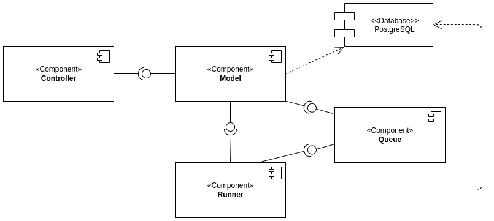
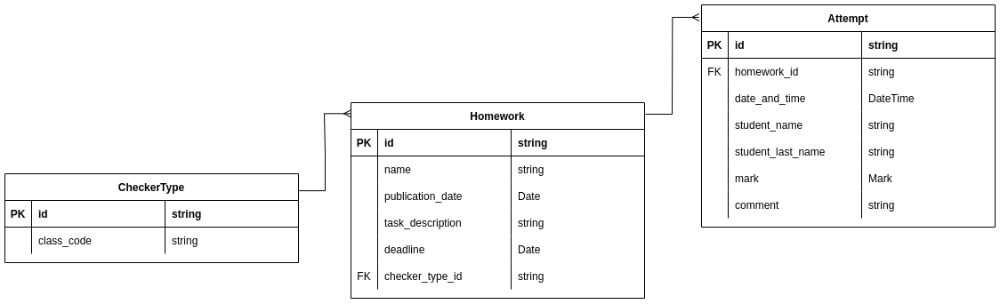

# Design document

## Список разработчиков

- Жемчужина Елизавета
- Кириллова Евгения
- Сунко Елена
- Иценко Екатерина

## Общие сведения о системе

### Назначение

Система представляет из себя веб-сервис для проверки домашних заданий.

### Границы системы

- Наличие веб-интерфейса
- 1 студент, 1 преподаватель, 1 курс
- Нет авторизации
- Нет валидации пользовательского ввода (считаем, что нам, например, не будут засылать вирус)

### Контекст

- Наличие веб-интерфейса
- REST API для доступа к информации, хранимой в системе

## Architectural drivers

### Технические ограничения

Должны быть предусмотрены библиотеки для работы с _RabbitMQ_, _PostgreSQL_ и _HTTP-запросами_.

### Бизнес-ограничения

- Срок разработки ограничен одной неделей
- В силу отсутствия бюджета, используются бесплатные фреймворки и библиотеки

### Качественные характеристики системы

- Система должна быть достаточно гибкой для дальнейшей расширяемости

### Ключевые функциональные требования

- Поскольку один студент может осуществлять несколько посылок, а чекер может работать долго предусмотрена балансировка
  нагрузки

## Architectural views

### Роли и случаи использования

#### Роли

- Студент
- Преподаватель

#### Случаи использования

- Студент может просматривать список домашних работ, отсортированный по близости дедлайна, причём должны показываться
  только работы, дата публикации которых уже наступила
- Студент может сдать решение в виде ссылки на GitHub — для этого ему надо кликнуть на элемент списка домашних работ, в
  результате чего он попадёт на экран с детальной информацией о работе (включая полное условие), полем для ввода ссылки
  на решение и кнопкой «Submit»
- Студент может просмотреть список результатов, отсортированный по дате сдачи
- Студент может просмотреть детальную информацию о попытке по клику на элемент списка результатов, включая текстовый
  вывод программы-проверялки
- Преподаватель может добавить новую домашнюю работу
- Преподаватель может просмотреть список результатов, отсортированный по дате сдачи
- Преподаватель может просмотреть детальную информацию о попытке по клику на элемент списка результатов, включая
  текстовый вывод программы-проверялки
- Преподаватель может добавить свою проверялку

#### Типичный пользователь

Это студентка ПМИ Елизавета Жемчужина. Она утомляется, когда делает домашнее задание, поэтому она хотела бы использовать
эффективную систему автоматической проверки, чтобы после сдачи задания больше о нем не думать. Кроме того, Елизавета
иногда хочет посмотреть на список уже сданных заданий, чтобы понять, какая она молодец.

Это преподаватель ПМИ Илона Маскова. Она очень устает от проверок домашних работ Елизаветы и хочет поменьше смотреть на
ее код. Именно поэтому она хочет пользоваться системой автоматической сдачи работ. Иногда Илона хочет посмотреть, почему
Елизавета сдала задачу всего со 101-ой попытки, поэтому ей нужна информация обо всех попытках сдачи.

P.S. Все совпадения с реальными людьми случайны.

### Композиция

В отдельные компоненты вынесена логика обработки запросов, бизнес-логика, работа с очередью задач, а также логика работы
раннеров

#### Описания компонент:

- **Controller** отвечает за роутинг и обработку входящих запросов, десериализацию переданных данных, координацию
  действий объектов доменной модели и формирование видов, которые надо отправить в ответ.
- **Model** представляет данные, с которыми работает приложение, и бизнес-логику по обработке этих данных
- **Queue** - очередь, в которую отправляются задачи на проверку
- **Runner** запускает все проверки

### Логическая структура

**Примечание**: на данном этапе названия и типы условные, уточнения будут внесены на этапе реализации.

#### Controller

Отвечает за обработку входящих запросов.

##### class StudentController

Класс-контроллер, отвечающий за действия (запросы) студента. Работает с JSON.

**Поля**:

- `HomeworkModelAssembler homeworkAssembler`
- `AttemptModelAssembler attemptAssembler`
- `Manager manager`

**Конструкторы**:

- `StudentController(HomeworkModelAssembler homeworkAssembler, AttemptModelAssembler attemptAssembler)`

**Методы**:

- `CollectionModel<EntityModel<HomeworkView>> homeworks()` - получение списка всех домашек в нужном порядке
- `String submit(Submission submission)` - отправка решения. В качестве аргумента передается само решение
- `CollectionModel<EntityModel<AttemptView>> results()` - список результатов, отсортированный по дате сдачи
- `EntityModel<AttemptView> results(Integer id)` - результат, соответствующий идентификатору _id_

##### class StudentHtmlController

Класс-контроллер, отвечающий за действия (запросы) студента. Работает с HTML.

**Поля**:

- `Manager manager` - менеджер приложения

**Конструкторы**:

- `StudentHtmlController()`

**Методы**:

- `String homeworks(Model model)` - получение списка всех домашек в нужном порядке
- `String results(Model model)` - список результатов, отсортированный по дате сдачи
- `String results(Integer id, Model model)` - результат, соответствующий идентификатору _id_

##### class TeacherController

Класс-контроллер, отвечающий за действия (запросы) преподавателя. Работает с JSON.

**Поля**:

- `AttemptModelAssembler attemptAssembler`
- `Manager manager`

**Конструкторы**:

- `TeacherController(AttemptModelAssembler attemptAssembler)`

**Методы**:

- `String homework(Task task)`- добавление домашки
- `CollectionModel<EntityModel<AttemptView>> results()`- список результатов, отсортированный по дате сдачи
- `String submit(Checker checker)` - добавление чекера
- `EntityModel<AttemptView> results(Integer id)` - результат, соответствующий идентификатору _id_

##### class TeacherHtmlController

Класс-контроллер, отвечающий за действия (запросы) преподавателя. Работает с HTML.

**Поля**:

- `Manager manager` - менеджер приложения

**Конструкторы**:

- `TeacherHtmlController()`

**Методы**:

- `String results(Model model)`- список результатов, отсортированный по дате сдачи
- `String results(Integer id, Model model)` - результат, соответствующий идентификатору _id_

##### class Submission

Класс, который хранит информацию о решении домашки. Именно его посылает клиент-студент.

**Поля**:

- `String homeworkId` - указывает на то, какой домашке соответствует данное решение
- `String solutionUrl`- ссылка на само решение

**Конструкторы**:

- `Submission(String homeworkId, String solutionUrl)`

**Методы**:

- `String getHomeworkId()` - возвращает _id_ домашки
- `String getSolutionUrl()` - возвращает ссылку на решение домашки

##### class Task

Класс, который хранит информацию о домашке. Именно его посылает клиент-преподаватель.

**Поля**:

- `String name` - название домашки
- `LocalDateTime publicationDate` - дата публикации домашки
- `String taskDescription` - условие домашки
- `LocalDateTime deadline` - дедлайн домашки
- `String checkerId` - _id_ чекера, соответствующего домашке

**Конструкторы**:

- `Task(String name, LocalDateTime publicationDate, String taskDescription, LocalDateTime deadline, String checkerId)`

**Методы**:

- `String name()` - возвращает название домашки
- `LocalDateTime publicationDate()` - возвращает дату публикации домашки
- `String taskDescription()` - возвращает условие домашки
- `LocalDateTime deadline()` - возвращает дедлайн домашки
- `String getCheckerId()` - возвращает _id_ чекера, соответствующего домашке

##### class Checker

Класс, который хранит информацию о чекере.

**Поля**:

- `String id` - _id_ чекера
- `String code`- реализация чекера

**Конструкторы**:

- `Checker(String id, String code)`

**Методы**:

- `String getId()` - возвращает _id_ чекера
- `String getCode()` - возвращает реализацию чекера

#### Model

Содержит данные и бизнес-логику, работающую с этими данными.

##### class Manager

Класс, содержащий в себе основную бизнес-логику.

**Поля**:

- `Balancer balancer` - балансировщик нагрузки

**Методы**:

- `List<HomeworkView> homeworks()` - возвращает список домашек
- `void submit(SubmissionView submissionView)` - отправка решения
- `List<AttemptView> results()` - возвращает описание всех попыток
- `void addHomework(HomeworkView homework)` - вызывается преподавателем для добавления домашки
- `void addChecker(String id, String code)` - добавление чекера. В качестве аргументов передаются _id_ чекера и его
  реализацию

##### enum Mark

Перечисление для результатов работы чекера.

**Поля**:

- YES
- NO

##### class Submission

Попытка решения домашки.

**Поля**:

- `String attemptId` - идентификатор попытки
- `String homeworkId` - идентификатор домашки, соответствующей попытке
- `String solutionUrl` - ссылка на решение домашки

**Конструкторы**:

- `Submission(String attemptId, String homeworkId, String solutionUrl)`

**Методы**:

- `String getAttemptId()` - возвращает идентификатор попытки
- `String getHomeworkId()` - возвращает идентификатор домашки
- `String getSolutionUrl()` - возвращает ссылку на решение

Для общения с базой данных:

##### class Homework

Информация о домашке.

**Поля**:

- `String id` - идентификатор домашки
- `String name` - название домашки
- `LocalDateTime publicationDate` - дата публикации домашки
- `String taskDescription` - описание задания
- `LocalDateTime deadline` - дедлайн
- `String checkerId` - _id_ чекера

**Конструкторы**:

- `Homework()`
- `Homework(String name, LocalDateTime publicationDate, String taskDescription, LocalDateTime deadline, String checkerId)`

**Методы**:

- `String getId()` - возвращает идентификатор домашки
- `void setId(String id)` - позволяет поменять идентификатор домашки на переданный
- `String getName()` - возвращает имя домашки
- `void setName(String name)` - позволяет поменять имя домашки на переданное
- `LocalDateTime getPublicationDate()` - возвращает дату публикации домашки
- `void setPublicationDate(LocalDateTime publicationDate)` - позволяет поменять дату публикации домашки на переданную
- `String getTaskDescription()` - возвращает описание задания
- `void setTaskDescription(String taskDescription)` - позволяет поменять описание задания на переданное
- `LocalDateTime getDeadline()` - возвращает дедлайн
- `void setDeadline(LocalDateTime deadline)` - позволяет поменять дедлайн на переданный
- `String getCheckerId()` - возвращает идентификатор чекера
- `void setCheckerId(String checkerId)` - позволяет поменять идентификатор чекера на переданный

##### class Checker

Информация о чекере.

**Поля**:

- `String id` - идентификатор чекера
- `String code` - код чекера

**Конструкторы**:

- `Checker()`
- `Checker(String id, String code)`

##### class Attempt

Информация о попытке сдачи домашки.

**Поля**:

- `String id` - идентификатор попытки
- `String homeworkId` - идентификатор домашки
- `LocalDateTime dateTime` - дата сдачи
- `Mark mark` - результат работы чекера
- `String comment` - комментарий к решению

**Конструкторы**:

- `Attempt()`
- `Attempt(String homeworkId, LocalDateTime dateTime)`

**Методы**:

- `String getId()` - возвращает идентификатор попытки
- `void setId(String id)` - позволяет заменить идентификатор попытки на переданный
- `String getHomeworkId()` - возвращает идентификатор домашки
- `void setHomeworkId(String homeworkId)` - позволяет заменить идентификатор домашки на переданный
- `LocalDateTime getDateTime()` - возвращает дату сдачи
- `void setDateTime(LocalDateTime localDateTime)` - позволяет заменить дату сдачи на переданную
- `Mark getMark()` - возвращает результат работы чекера
- `void setMark(Mark mark)` - позволяет заменить результат работы чекера на переданный
- `String getComment()` - возвращает комментарий к решению
- `void setComment(String comment)` - позволяет заменить комментарий к решению на переданный

##### class Storage

Информация о сеансах работы с базой данных (подключение и конфигурация).

**Поля**:

- `SessionFactory sessionFactory`

**Методы**:

- `SessionFactory getSessionFactory()` - возвращает фабрику сессий

##### class AttemptView

Класс, ответственный за информацию о попытке сдачи (для отображения).

**Поля**:

- `HomeworkView homework` - информация о домашке
- `MarkView mark` - информация об оценке
- `String comment` - комментарий к решению
- `LocalDateTime date` - дата и время попытки

**Конструкторы**:

- `AttemptView(HomeworkView homework, MarkView mark, String comment, LocalDateTime date)`

**Методы**:

- `HomeworkView homework()` -возвращает информацию о домашке (отображение)
- `MarkView mark()` - возвращает оценку чекера (отображение)
- `String comment()` - возвращает комментарий к решению
- `LocalDateTime date()` - дата и время попытки

##### class HomeworkView

Класс, ответственный за информацию о домашке (для отображения).

**Поля**:

- `String id` - идентификатор домашки
- `String name` - название домашки
- `LocalDateTime publicationDate` - дата публикации
- `String taskDescription` - описание задания
- `LocalDateTime deadline` - дедлайн
- `String checkerId` - идентификатор чекера, соответствующего домашке

**Конструкторы**:

- `HomeworkView(String id, String name, LocalDateTime publicationDate, String taskDescription, LocalDateTime deadline, String checkerId)`
- `HomeworkView(String name, LocalDateTime publicationDate, String taskDescription, LocalDateTime deadline, String checkerId)`

**Методы**:

- `String id()` - возвращает идентификатор домашки
- `String name()` - возвращает название домашки
- `LocalDateTime publicationDate()` - возвращает дату публикации
- `String taskDescription()` - возвращает описание задания
- `LocalDateTime deadline()` - возвращает дедлайн домашки
- `String checkerId()` - возвращает идентификатор чекера

##### class SubmissionView

Класс, за информацию о посылке (для отображения).

**Поля**:

- `String homeworkId` - идентификатор домашки
- `String solutionUrl` - ссылка на решение

**Конструкторы**:

- `SubmissionView(String homeworkId, String solutionUrl)`

**Методы**:

- `String getHomeworkId()` - возвращает идентификатор домашки
- `String getSolutionUrl()` - возвращает ссылку на решение

##### class MarkView

Класс, ответственный за информацию об оценке.

**Поля**:

- `String mark` - оценка

**Конструкторы**:

- `MarkView(String mark)`

**Методы**:

- `String getMark()` - возвращает оценку

#### Runner

Прогоняет проверки.

##### class Runner

Собственно, раннер, на котором производится прогон проверок.

**Поля**:

- `String TASK_QUEUE_NAME` - имя очереди задач

**Методы**:

- `void main(String[] argv)` - запуск раннера

#### Queue

Очередь, в которую отправляются задачи на проверку. Состоит из:

- RabbitMQ
- **class Balancer** с полем `String TASK_QUEUE_NAME` (имя очереди задач) и методом `void task(Submission submission)`,
  отвечающим за балансировку нагрузки (распределение между очередями).

#### Database

В качестве базы данных используется _PostgreSQL_.

#### Диаграмма

### Модель данных

#### ER-диаграмма

В базе данных буду хранится:

1. домашнии задании (`table Homework`), каждое хранит название, дату публикации, описание и дедлайн и ссылается на
   нужную проверядку
2. типы чекеров (`table CheckerType`), каждый хранит заданный учителем код проверялки
3. попытки (`table Attempt`), каждая хранит дату, информацию о студенте (имя и фамилия), информацию о результате
   (оценка и комментарий, могут быть равны `null`, если попытка еще не проверена) и ссылается на соответствующее
   домашнее задание

## Обоснование принятых решений:

Для работы был выбран [Spring Framework](https://spring.io/projects/spring-framework).

В качестве альтернативы рассматривали так же [Ktor](https://github.com/ktorio/ktor), однако, во-первых, у нас есть
некоторый опыт работы со `Spring Framework`, а, во-вторых, у `Ktor` хуже документация

